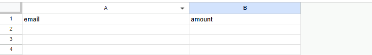

# AmoCRM ↔ Google Sheets Integration

## Описание

Интеграция обеспечивает **двухстороннюю синхронизацию** между Google Sheets и AmoCRM:

- **Google Sheets → AmoCRM**
    - добавление строки создаёт сделку в AmoCRM;
    - изменение строки обновляет сделку.

- **AmoCRM → Google Sheets**
    - изменение сделки обновляет строку в Google Sheets.

Таким образом, данные в CRM и таблице всегда находятся в актуальном состоянии.

---

## 🛠 Используемые технологии

- FastAPI
- dishka — внедрение зависимостей (dependency injection);
- pydantic — валидация входящих данных (email, сумма);
- amocrm_api — работа с AmoCRM REST API;
- redis — хранилище связей между Google Sheets и AmoCRM;
- gspread — взаимодействие с Google Sheets API;

---

## Архитектура

### 1. **API (FastAPI)**

- `POST /leads/upsert` — обновление или создание сделки из строки Google Sheets.
- `POST /lead` — обработка вебхука AmoCRM (изменения сделки).

### 2. **Use Cases**

- `UpsertLeadUseCase`
    - проверяет, есть ли сделка для строки;
    - обновляет или создаёт сделку в AmoCRM.
- `LeadChangedUseCase`
    - обрабатывает изменение сделки в AmoCRM;
    - обновляет строку в Google Sheets.

### 3. **Gateways**

- `LeadGateway` — обёртка над AmoCRM API.
- `SheetsGateway` — работа с Google Sheets API.
- `SheetsLeadGateway` — хранение связки row_id ↔ lead_id (Redis).

---

## Доступ из внешних сервисов

Так как Google Apps Script и AmoCRM вебхуки не могут обращаться к `localhost`, при запуске нужно будет использовать
сервис для проброса порта наружу. Например, **tuna**

Чтобы получить URL выполнить tuna http 8000

Именно этот URL указывается:

- в скриптах Google Apps Script (для отправки данных в API),
- в настройках вебхуков AmoCRM (для получения событий).

Tuna автоматически перенаправляет запросы с этого адреса на локальный сервер FastAPI (`http://localhost:8000`). Можно
использовать любой другой аналогичный сервис

## Установка и запуск

1. Создать таблицу с двумя столбцами `email`    `amount`
   
2. Расширения -> appscript -> добавить туда код из src/app/script.gs заменив значение base_url на полученный URL.
   
3. Триггеры -> Добавление триггера -> Функция: onEdit. Источник события: Из таблицы. Тип события: При редактировании.
   Развертывание: Основное. Уведомления об ошибках: по желанию

4. Добавить сервисный аккаунт в таблицы с правами редактирования
5. Добавить вебхук в amocrm на событие "Сделка изменена" с URL "URL/lead"
6. Клонируйте репозиторий:

```
https://github.com/iMaanick/AmocrmIntegration.git
```

7. Добавьте файл .env и заполните его как в примере .example.env. GOOGLE_SPREADSHEET_URL - ссылка на таблицу,
   GOOGLE_SPREADSHEET_NAME - название листа
8. Выполните docker-compose -f docker-compose.yaml up --build